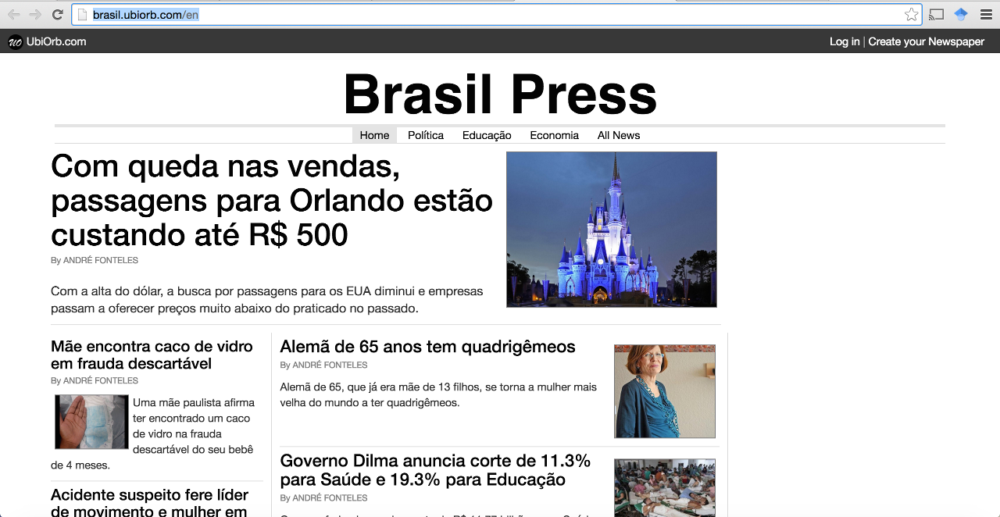

# UbiOrb

Are you unsatisfied with the way news are being told in the big newspapers? Do you think the editorial lines of the traditional media has been subject to the will of big corporate groups or even, sometimes mostly, of the government itself?

Over the recent years, we have already seem powerful changes in our society fuelled by the mobilisation of ordinary people on social medias. Governments and corporations have become more than ever exposed and afraid of the dissemination of information that might be harmful for their interests and positions. Arguably, social medias are indispensable tools for people's mobilisation, but we believe we can go further.  

**What is**

The UbiOrb Project seeks to develop a platform that fosters citizen journalism and, therefore, a more plural, independent and free press. In order to achieve this objective, UbiOrb must first allow ordinary citizens to create their own news website and publish news the way they think it is meant to be.

Once this first step done, other important functionalities must be added to the platform. For example, we plan to implement some type (yet to be defined) of ranking for news and news websites according to their credibility. It could be also interesting to allow anyone (even unregistered users) to submit articles to any news website. The website team would be in charge of accepting or not the article, occasionally editing it beforehand. Possible features such as these ones briefly presented here must be suggested, discussed and later implemented, if valuable, in order to achieve our goals.   

Another positive impact of the UbiOrb Project is supporting inhabitants from smaller or sparsely populated regions to easily create and maintain their own local news media.

We believe the crowd (i.e., the power of every individual and the collectivity) if correctly guided, can play a key role in fostering a more plural, free and independent media. 

**What is not**

UbiOrb **is not** meant to be a regular CMS, although it must share many of its features. Keep in mind that we have different goals. Therefore, we expect to see distinct features on UbiOrb as it develops.

**Some Current Features**
- Create news website with its own subdomain

- Publish news with image and/or youtube videos

- Invite new contributos to a website to help publishing news

- Invite new contributors to help administrating the news website

- English and Portuguese translations

Here is an example of a news website created with UbiOrb: http://brasil.ubiorb.com (notice, portuguese content).



**Possible Directions**
- Allow readers and anonymous users to propose news articles

- Rate news and news website according to some credibility measure

- Create a hub of popular news from different websites 

- _Make a suggestion_!

**Inspiration**

The UbiOrb Project finds inspirations from various different concepts and ideas. Some related subjects are:
[free press](https://en.wikipedia.org/wiki/Freedom_of_the_press), [citizen journalism](https://en.wikipedia.org/wiki/Citizen_journalism) and [independent media](https://en.wikipedia.org/wiki/Independent_media).

**Technical Features**

The UbiOrb platform is based on PHP and Symfony 2.3.

**Preparing Development Environment**

(Linux or Mac)

1. Clone project: 
```
git clone https://github.com/Andre-Fonteles/UbiOrb.git
```

2. Install composer:
```
curl -sS https://getcomposer.org/installer | php
sudo mv composer.phar /usr/local/bin/composer
```

3. Enter the /UbiOrb and run composer to install vendors and configure parameters of your local development environment (e.g., database password, etc)
```
composer install
```

4. Configure a your database according to information provided on step 3.

5. Create database tables using doctrine
```
php app/console doctrine:schema:update --force
```

6. Alter permissions on "UbiOrb/app/cache" "UbiOrb/app/log" and "UbiOrb/web/u" so that apache may have permission to create edit and delete files within them. We will use chmod -R 777 for this, but feel free to choose other method.
```
sudo chmod -R 777 app/cache app/logs web/u
```

7. Create a VirtualHost for apache
```
<VirtualHost *:80>
    ServerName ubiorb.com.local
    ServerAlias *.ubiorb.com.local

    DocumentRoot /directory/to/project/UbiOrb/web
    <Directory /directory/to/project/UbiOrb/web>
        AllowOverride None
        Require all granted

        <IfModule mod_rewrite.c>
            Options -MultiViews
            RewriteEngine On
            RewriteCond %{REQUEST_FILENAME} !-f
            RewriteRule ^(.*)$ app.php [QSA,L]
        </IfModule>
    </Directory>

    ErrorLog /Applications/XAMPP/etc/project_error.log
    CustomLog /Applications/XAMPP/etc/project_access.log combined
</VirtualHost>
```

8. Add the following line to the /etc/hosts file
```
127.0.0.1 ubiorb.com.local
127.0.0.1 mywebsite.ubiorb.local
```

9. Test the website accessing:
```
http://ubiorb.com.local
```

PS: To test the creation of a News Website, login on http://ubiorb.com.local, access the option to create a Newspaper and use _mywebsite_ as domain. 

**Contributing**

We do support and encourage contributions. Anyone interested in participating in this UbiOrb project is more than welcome.
